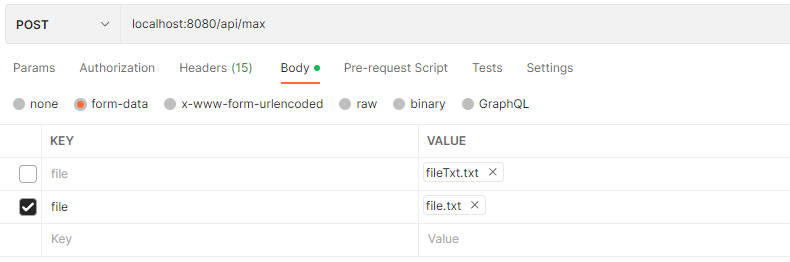
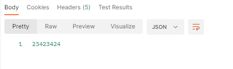
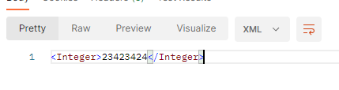

# RestCalculator
## Обзор 
RESTful API приложение для обработки массивов целых чисел в файлах формата txt.

### Приложение позволяет вычислить:
*  максимальное число в файле;
*  минимальное число в файле;
* медиана;
* среднее арифметическое значение;
* самая длинная возрастающая последовательность идущих подряд чисел;
* самая длинная убыавающая последовательность идущих подряд чисел.

### Также реализовано:
* приложение по заросу может возвращать данные в json или xml;

  (формат изменяется добавлением header)

`
accept:application/json или accept:application/xml к HTTP-заросу.
`
* подключен и настроен swagger;
* передача файла в бинарном виде;
* кеширование результата с помощью Spring Cache;

### Использованные технологии
* Java 11
* Spring Boot
* Maven
* JUnit 5
* Swagger
* Spring Cache

## Для файла  `testFile.txt`, который лежит в корне проекта итоговые результаты приведены в таблице
| Искомое                                       |                        Результат                        |
|:----------------------------------------------|:-------------------------------------------------------:|
| Максимальное число                            |                        23423424                         |
| Минимальное число                             |                        -1234242                         |
| Среднее арифметическое                        |                    821826.3333333334                    |
| Медиана                                       |                            3                            |
| Макс. возрастающая последовательность/сти     |                     1 5 6 7 8 9 10                      |
| Макс. убывающая последовательность/сти        | (33, -1),  (23423424, -1234242), (3, 2), (3, 0), (7, 1) |

## Endpoints
`POST api/max` 
### Возвращает максимальное число в файле.
В случае размещения приложения на порте 8080, запрос будет выглядеть:
**localhost:8080/api/max** - все остальные запросы строятся аналагично.
#### Параметры:
`file: Multipart` - Переданный файл, в котором будет вестись поиск.
#### Ответ:
`23423424`

#### Пример запроса 

#### Пример ответа:
##### JSON

##### XML

Для выбора формата ответа достаточно добавить Header `Accept` или изменить его значение.

* Для JSON: `application/json`
* Для XML: `application/xml`
---
`POST api/min`
### Возвращает минимальное число в файле.
#### Параметры:
`file: Multipart` - Переданный файл, в котором будет вестись поиск.
#### Ответ:
 `-1234242` 

 ---
`POST api/average`
### Возвращает среднее арифметическое значение среди всех чисел в файле.
#### Параметры:
`file: Multipart` - Переданный файл, в котором будет вестись поиск.
#### Ответ:
`821826.3333333334`

---
`POST api/median`
### Возвращает медиану ряда.
#### Параметры:
`file: Multipart` - Переданный файл, в котором будет вестись поиск.
#### Ответ:
`3`

---
`POST api/descending`
### Возвращает наибольшую убывающую последовательность/сти.
#### Параметры:
`file: Multipart` - Переданный файл, в котором будет вестись поиск.
#### Ответ:
`[[33, -1], [23423424, -1234242], [3, 2], [3, 0], [7, 1]]`

---
`POST api/ascending`
### Возвращает наибольшую возрастающую последовательность/сти.
#### Параметры:
`file: Multipart` - Переданный файл, в котором будет вестись поиск.
#### Ответ:
`[[1, 5, 6, 7, 8, 9, 10]]`
